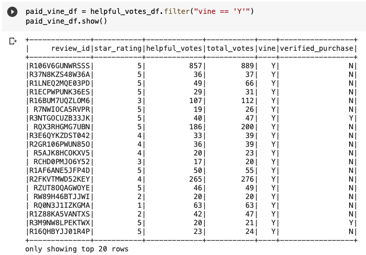
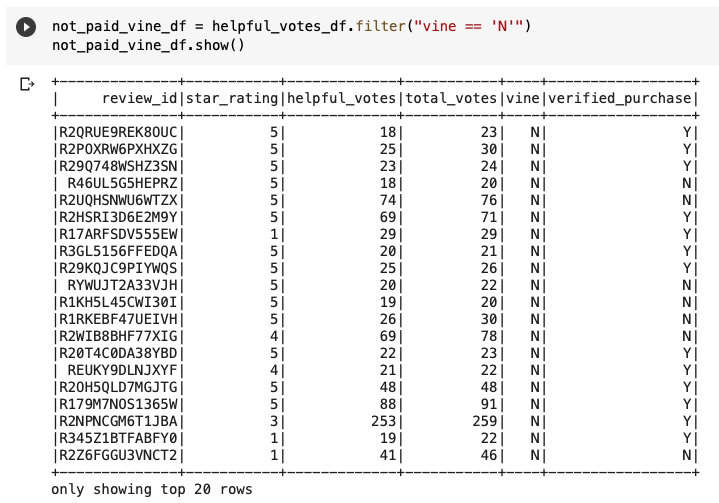
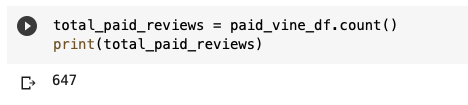
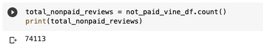
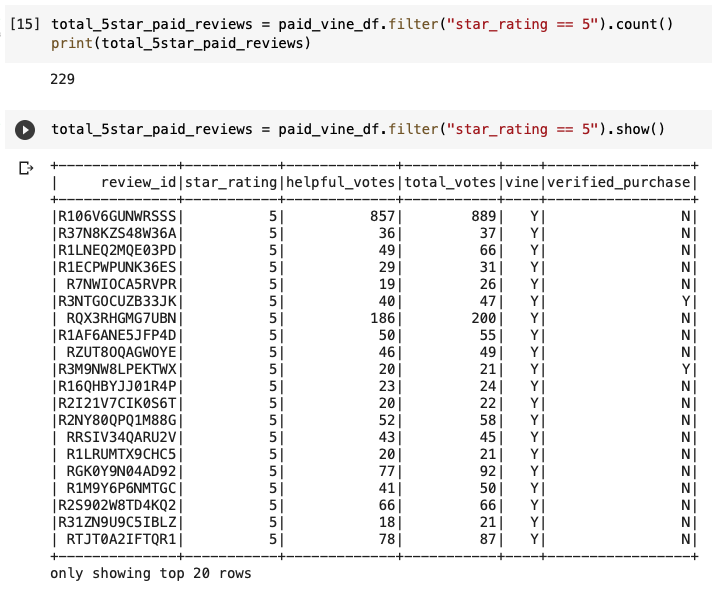
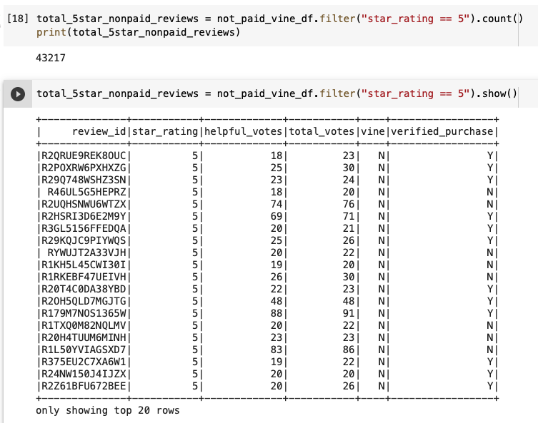
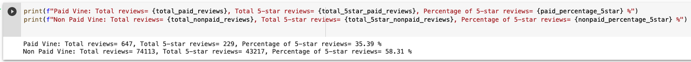

# Amazon Vine Analysis

## Overview

### Purpose

BigMarket is a startup company that helps businesses optimize their marketing efforts. The purpose of this project is to provide an analysis on Amazon reviews to SellBy, one of BigMarket's clients. The Amazon reviews are written by members of the paid Amazon Vine program. The Amazon Vine program is a service that allows manufacturers and publishers to receive reviews for their products. Companies like SellBy pay a small fee to Amazon and provide products to Amazon Vine members, who are then required to publish a review.

For this project, PySpark was used to perform the ETL process. That is, to extract the dataset, transform the data, connect to an AWS RDS instance, and load the transformed data into pgAdmin. Additionally, PySpark was used to determine if there was any bias toward favorable reviews from Vine members in the dataset. 

  

## Results

### Dataset and Files

The analysis is based on the following: 

* Dataset - Product Category: Beauty "https://s3.amazonaws.com/amazon-reviews-pds/tsv/amazon_reviews_us_Beauty_v1_00.tsv.gz"
* ETL on Amazon Product Reviews: [Amazon_Reviews_ETL](Amazon_Reviews_ETL.ipynb)
* Vine Reviews: [Vine_Review_Analysis](Vine_Review_Analysis.ipynb)

### Software and Application

The software and web-based application used for this analysis are:

* Colaboratory, or Colab - a Google Research product
* Pyspark - Spark and Python for Big Data  
* Amazon Web Services, or AWS - RDS and S3
* pgAdmin 4 - Version 6.1

### Outcomes 

An initial data exploration on Amazon's Beauty products dataset was done to filter product reviews that were written by members of the paid Amazon Vine program as well as from non-paid individuals.

Here are 3 questions with its respective answers worth highlighting from Amazon's Beauty product reviews:

* **How many Vine reviews and non-Vine reviews were there?**

There were 647 reviews from members of the paid Amazon Vine program and 74,113 reviews from non-paid individuals. Below is a snapshot of the dataframes displaying the top 20 rows.

  
   

Please note, these numbers were calculated after filtering all the rows where the votes were equal to or greater than 20 total votes. Then, retrieving all the rows where the number of helpful votes divided by total votes were equal to or greater than 50%. Finally, displaying only the rows where a review was written as part of the Vine program (paid), vine == 'Y' and rows where the review was not part of the Vine program (unpaid), vine == 'N', respectively.

* **How many Vine reviews were 5 stars? How many non-Vine reviews were 5 stars?**

There were 229 5-stars reviews from members of the paid Amazon Vine program and 43,217 5-stars reviews from non-paid individuals. Below is a snapshot of the dataframes displaying the top 20 rows.

  
   

* **What percentage of Vine reviews were 5 stars? What percentage of non-Vine reviews were 5 stars?**

As shown below, 35.39% of Vine reviews were 5 stars and 58.31% of non-Vine reviews were 5 stars. This shows there are a lot more beauty product reviews coming in from non-paid individuals that Amazon receives versus the paid vine members. This perhaps could be due to the fact that Amazon Vine is an invitation-only program. This means customers who consistently write helpful reviews and develop a reputation for expertise in specific product categories are most likely to be invited into the program. 

      
## Summary

As mentioned in the results, 35.39% of Vine reviews were 5 stars. Even though these reviews are written by members of the paid Amazon Vine program, it is not led to believe that there is a positivity bias for reviews of the beauty products in the Vine program. This is mainly due to the conservative percentage of the 5-star reviews found in this analysis and most likely because it’s an invitation-only program. Which means, a selective group of people are encouraged to submit their reviews for beauty products at Amazon.

With that stated, an additional analysis using the data from the *verified purchase* column could be used to further analyze the quality of these reviews. The data can be further filtered to consider reviews from the vine program, that have more than 20 total votes and that a purchase has been verified. It is found that an "Amazon Verified Purchase" review means Amazon has verified that the person writing the review purchased the product at Amazon and didn't receive the product at a deep discount. This can further confirm the reviews are unbiased. 

In conclusion, a data exploration on Amazon's Beauty products dataset was done to filter product reviews that were written by members of the paid Amazon Vine program as well as from non-paid individuals. PySpark was used to perform the ETL process. That is, to extract the dataset, transform the data, connect to an AWS RDS instance, and load the transformed data into pgAdmin. Additionally, PySpark was used to determine if there was any bias toward favorable reviews from Vine members in the dataset. 

  
  

